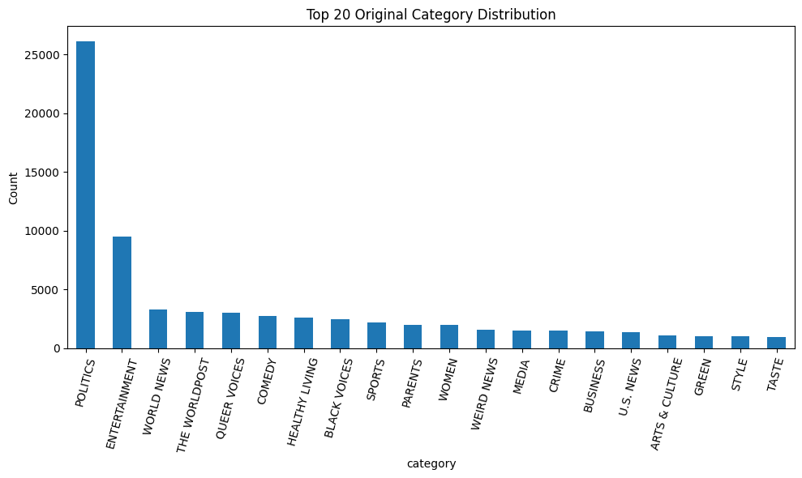
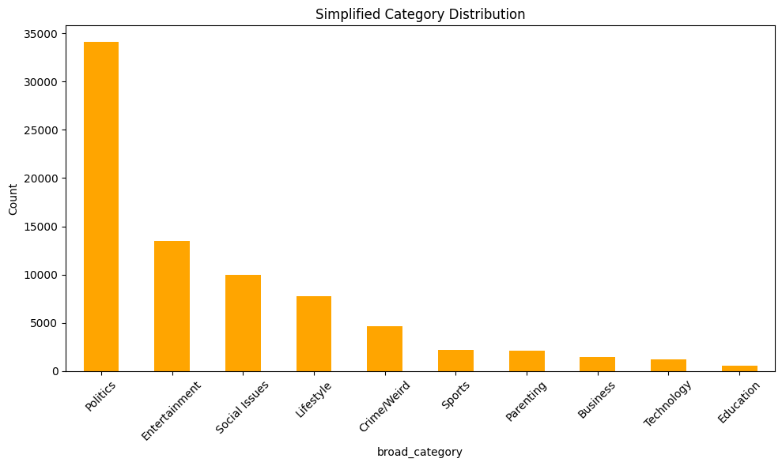
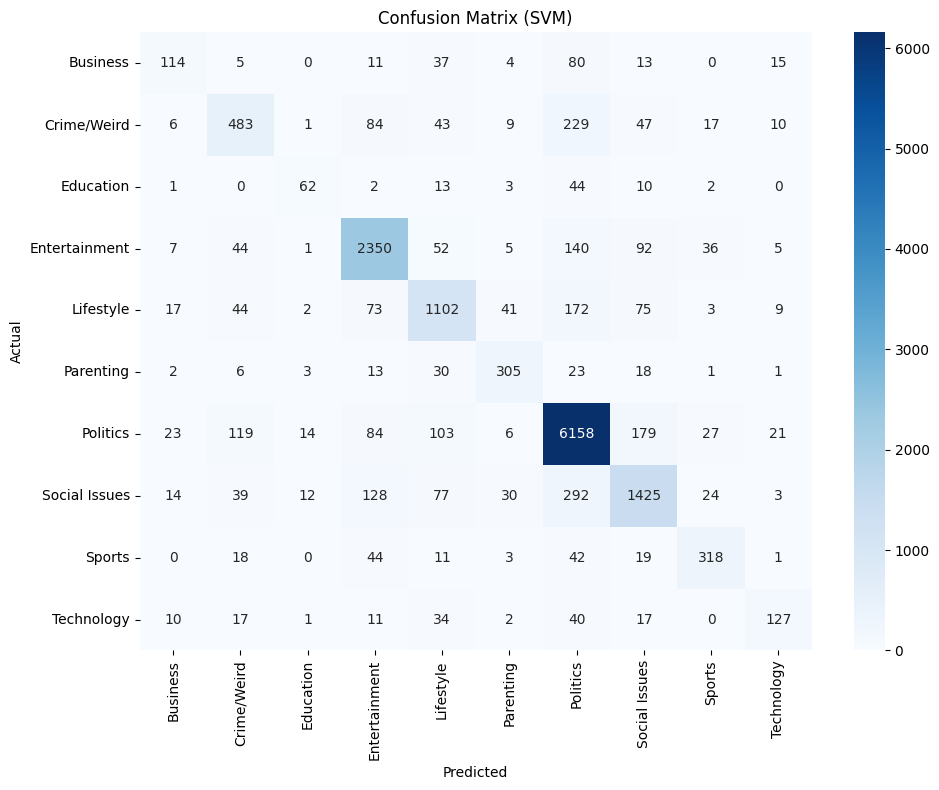
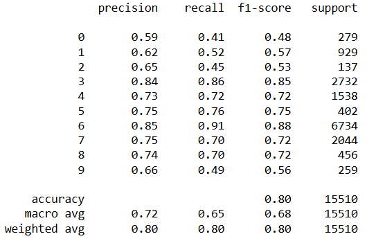

# 📰 News Category Classification using NLP

This project aims to classify news articles into predefined categories using natural language processing and machine learning.

## 📌 Overview

Given a dataset of news headlines and short descriptions, the goal is to predict the **category** of each article. This is a **multi-class classification** problem with **textual input**.

### 🔍 Dataset

- Source: News Category Dataset (HuffPost)
- Total samples: ~150,000
- Features used: `headline`, `short_description`
- Original categories: 40+
- Simplified into 10 categories:
  - Lifestyle
  - Politics
  - Entertainment
  - Social Issues
  - Parenting
  - Crime/Weird
  - Business
  - Sports
  - Technology
  - Education

## 🛠️ Tools and Libraries

- Python
- Pandas, NumPy
- Scikit-learn
- XGBoost
- Seaborn & Matplotlib
- TfidfVectorizer for text vectorization

## 🧠 Models Tried

| Model               | Accuracy | Macro F1 |
|--------------------|----------|----------|
| Logistic Regression| 0.80     | 0.66     |
| SVM (Linear)       | 0.80     | **0.68** |
| XGBoost            | 0.76     | 0.64     |
| Multinomial NB     | 0.77     | 0.56     |

🏆 **Best Performing Model**: SVM (Linear Kernel)

## 📊 Visuals

- Class distribution before & after simplification

  

  

- Confusion matrix of best model
  
  

## 📈 Classification Report (SVM)

